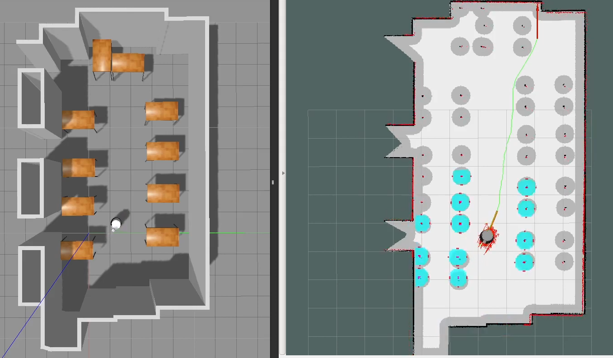
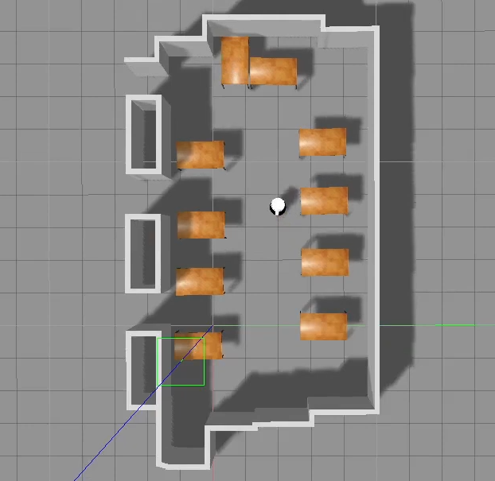
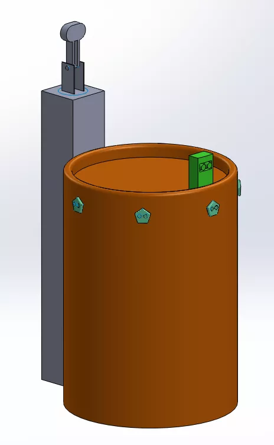

# Robot systems laboratory homework
This is the repo for our custom node made for our laboratory homework.

The homework consist of three main parts:
- the project builds upon a robotnik rb1 base robot which we extended with an upper structure and UH sensors according to a real robot being developed at ELTE's ethology department
- we made a custom map for the project based on the test environment the robot is used in
- we made a custom node that is capable of extending the robot's move_base with basic waypoint navigation

## Results
### Images
<p align="center">

</p>

### Videos
 - simulation [link](https://www.youtube.com/watch?v=X01jmzssdb0)
 - simulation (waypoint looping) [link](https://www.youtube.com/watch?v=a97YtZk537k)

## Modifications
 - creating a custom map based on the test environment
 - 
 - creating a new 3D model of the robot including the upper structure
 - 
 - extending the robot with UH sensors in the simulation environment
 - creating a new custom node (multi-goal navigation) for the robot
 - creating simulations to test the functions of the robot in the test environment
 - creating an all-in-all launch file for simulating the new node

## Dependencies (to run the simulation)
### Our stuff
- rb1_base_common (our fork) [link](https://github.com/PhylMacao/rb1_base_common)
- rb1_base_sim (our fork) [link](https://github.com/PhylMacao/rb1_base_sim)

### Original robotnik packages
- robotnik_sensors [link](https://github.com/RobotnikAutomation/robotnik_sensors)
```
git clone -b melodic-devel https://github.com/RobotnikAutomation/robotnik_sensors
```
- robotnik_msgs [link](https://github.com/RobotnikAutomation/robotnik_msgs)
```
git clone https://github.com/RobotnikAutomation/robotnik_msgs
```

### Additional packages
```
sudo apt install ros-melodic-mavros-msgs
sudo apt install ros-melodic-robot-localization
sudo apt install ros-melodic-imu-complementary-filter
```

### Additional packages that may not needed
- robot_localization_utils [link](https://github.com/RobotnikAutomation/robot_localization_utils)
- robotnik_base_hw_sim [link](https://github.com/RobotnikAutomation/robotnik_base_hw_sim)


In the workspace install the packages dependencies:
  ```bash
  rosdep install --from-paths src --ignore-src -r -y
  ```

## How to run project
You can run the project with the following command:
```bash
roslaunch robotlab_hw robotlab_hw.launch
```
if you don't want looping you can add `loop:=false`

You can launch the modified rb-1 base simulation.
```bash
roslaunch rb1_base_sim_bringup rb1_base_complete.launch
```

And then run the path_publisher node manually:
```bash
rosrun robotlab_hw path_publisher.py
```
